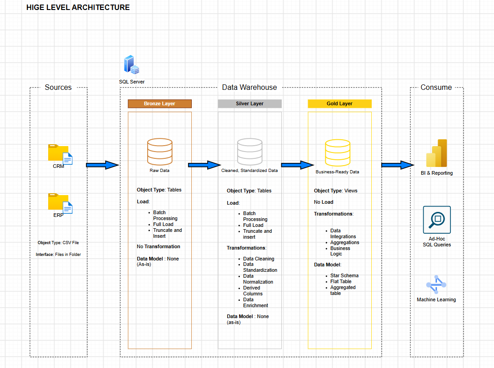

# Data Warehouse and Analytics Project

Welcome to the Data Warehouse and Analytics Project repository! 🚀

This project demonstrates a comprehensive data warehousing and analytics solution, from building a data warehouse to generating actionable insights. Designed as a portfolio project, it highlights industry best practices in data engineering and analytics.

---

## 📖 Project Overview

This project involves:

1. **Data Architecture:** Designing a Modern Data Warehouse Using Medallion Architecture Bronze, Silver, and Gold layers.
2. **ETL Pipelines:** Extracting, transforming, and loading data from source systems into the warehouse.
3. **Data Modeling:** Developing fact and dimension tables optimized for analytical queries.
4. **Analytics & Reporting:** Creating SQL-based reports and dashboards for actionable insights.

🎯 This repository is an excellent resource for professionals and students looking to showcase expertise in:

- SQL Development
- Data Architect
- Data Engineering
- ETL Pipeline Developer
- Data Modeling
- Data Analytics

---

## 🛠️ Important Links & Tools:

Everything is for Free!

- **[Datasets](datasets/):** Access to the project dataset (csv files).
- **[SQL Server Express](https://www.microsoft.com/en/sql-server/sql-server-downloads):** Lightweight server for hosting your SQL database.
- **[SQL Server Management Studio (SSMS)](https://learn.microsoft.com/en-us/ssms/sql-server-management-studio-ssms):** GUI for managing and interacting with databases.
- **[Git Repository](https://github.com/Denilson47/sql-data-warehouse-project):** Set up a GitHub account and repository to manage, version, and collaborate on your code efficiently.
- **[DrawIO](https://app.diagrams.net/):** Design data architecture, models, flows, and diagrams.
- **[Notion](https://www.notion.com/):** All-in-one tool for project management and organization.
- **[Notion Project Steps](https://app.notion.com/p/piusdenilson/SQL-Data-Warehouse-Project-3b98d989ad8880b48f85e2aa7fa0f6e2?source=copy_link):** Access to All Project Phases and Tasks.

---

## 🚀 Project Requirements

### Building the Data Warehouse (Data Engineering)

#### Objective

Develop a modern data warehouse using SQL Server to consolidate sales data, enabling analytical reporting and informed decision-making.

#### Specifications

- **Data Sources:** Import data from two source systems (ERP and CRM) provided as CSV files.
- **Data Quality:** Cleanse and resolve data quality issues prior to analysis.
- **Integration:** Combine both sources into a single, user-friendly data model designed for analytical queries.
- **Scope:** Focus on the latest dataset only; historization of data is not required.
- **Documentation:** Provide clear documentation of the data model to support both business stakeholders and analytics teams.

---

### BI: Analytics & Reporting (Data Analytics)

#### Objective

Develop SQL-based analytics to deliver detailed insights into:

- **Customer Behavior**
- **Product Performance**
- **Sales Trends**

These insights empower stakeholders with key business metrics, enabling strategic decision-making.

For more details, refer to [requirements.md](docs/requirements.md).

---

## 🏗️ Data Architecture

The data architecture for this project follows Medallion Architecture Bronze, Silver, and Gold layers:

1. **Bronze Layer:** Stores raw data as-is from the source systems. Data is ingested from CSV Files into SQL Server Database.

2. **Silver Layer:** This layer includes data cleansing, standardization, and normalization processes to prepare data for analysis.

3. **Gold Layer:** Houses business-ready data modeled into a star schema required for reporting and analytics.

---

## 📂 Repository Structure

~~~text
sql-data-warehouse-project/
│
├── datasets/                           # Raw datasets used for the project (ERP and CRM data)
│   ├── source_crm/                     # CRM source data
│   │   ├── cust_info.csv
│   │   ├── prd_info.csv
│   │   └── sales_details.csv
│   │
│   └── source_erp/                     # ERP source data
│       ├── CUST_AZ12.csv
│       ├── LOC_A101.csv
│       └── PX_CAT_G1V2.csv
│
├── docs/                               # Project documentation and architecture details
│   ├── ETL.png                         # ETL process diagram
│   ├── data_architecture.drawio        # Draw.io file showing the project's architecture
│   ├── data_architecture.png           # Project data architecture diagram
│   ├── data_catalog.md                 # Catalog of datasets, including field descriptions and metadata
│   ├── data_flow.drawio                # Draw.io file for the data flow diagram
│   ├── data_flow.png                   # Project data flow diagram
│   ├── data_integration.drawio         # Draw.io file for the data integration diagram
│   ├── data_integration.png            # Project data integration diagram
│   ├── data_model.drawio               # Draw.io file for data models (star schema)
│   ├── data_model.png                  # Project data model diagram
│   ├── naming_conventions.md           # Consistent naming guidelines for tables, columns, and files
│   └── requirements.md                 # Detailed project requirements and specifications
│
├── scripts/                            # SQL scripts for ETL and transformations
│   ├── bronze/                         # Scripts for extracting and loading raw data
│   ├── silver/                         # Scripts for cleaning and transforming data
│   └── gold/                           # Scripts for creating analytical models
│
├── tests/                              # Test scripts and quality files
│   ├── quality_checks_gold.sql         # Gold layer data quality checks
│   └── quality_checks_silver.sql       # Silver layer data quality checks
│
├── .gitignore                          # Files and directories to be ignored by Git
├── LICENSE                             # License information for the repository
├── README.md                           # Project overview and instructions
└── requirements.txt                    # Project requirements and dependencies
~~~

---

## 🧪 Data Quality & Testing

Data quality checks are implemented to ensure that the data meets the expected standards before being used for analytics.

Testing includes checks for:

- Data completeness
- Data consistency
- Data accuracy
- Duplicate records
- Null values
- Referential integrity
- Valid business rules

The quality-check scripts are located in the `tests/` directory:

- `quality_checks_silver.sql`
- `quality_checks_gold.sql`

---

## 📚 Documentation

The project documentation contains detailed information about the architecture, data flow, data integration, data model, data catalog, ETL process, naming conventions, and project requirements.

Available documentation includes:

- [Data Catalog](docs/data_catalog.md)
- [Naming Conventions](docs/naming_conventions.md)
- [Data Architecture](docs/data_architecture.png)
- [Data Flow](docs/data_flow.png)
- [Data Integration](docs/data_integration.png)
- [Data Model](docs/data_model.png)
- [ETL Documentation](docs/ETL.png)
- [Project Requirements](docs/requirements.md)

---

## 🛡️ License

This project is licensed under the MIT License. You are free to use, modify, and share this project with proper attribution.

---

## 👨‍💻 About Me

Hi there! I'm **Denilson Pius**, an aspiring Data Engineer passionate about data engineering, data warehousing, and analytics.

I'm currently developing my skills in SQL, Microsoft SQL Server, data warehousing, ETL pipelines, data modeling, and data analytics through practical projects and hands-on learning.

Let's stay in touch! Feel free to connect with me on the following platforms:

- [LinkedIn](https://www.linkedin.com/in/denilsonpius/)
- [GitHub](https://github.com/Denilson47)
